# HandyFix

<!--add mock up picture here-->

---

## Table of content
* [**About**](#about)
* [**User Experiences**](#user-experiences)
  * [**User Stories**](#user-stories)
  * [**Strategy**](#strategy)
  * [**Scope**](#scope)
  * [**Structure**](#structure)
  * [**Skeleton**](#skeleton)
  * [**Surface**](#surface)
* [**Technologies Used**](#technologies-used)
  * [**Languages**](#languages)
  * [**Tools**](#tools)
* [**Features**](#features)
* [**Future features**](#future-features)
* [**Deployment**](#deployment)
* [**Credits**](#credits)
  * [**Content**](#content)
  * [**Media**](#media)
* [**Acknowledgements**](#acknowledgements)

## About

HandyFix is a reliable and responsive website about the company that provides handyman services for people in and around London. The site will target individuals who need one or more of these services.

A handyman business typically offers a wide range of services related to home maintenance, repairs, and improvements. Some services offered by the handyman business include general repairs, carpentry, painting, plumbing, electrical repairs, etc.

The user will be provided with the essential information and pricing about the services, as well as a gallery that will allow them to see the previous projects that have been done by the highly skilled and experienced specialists at HandyFix. All this will give the user the confidence that they are making the right decision by choosing to get in touch.

<!--add link to the live website here***Click**[here]()**to view the live website.***-->

## User Experiences

### **User Stories**

#### **First-time visitor goals:**

- As a first-time visitor, I want to easily understand the main purpose of the site and learn more about the company.

- As a first-time visitor, I want to be able to easily navigate through the site to find content.

- As a first-time visitor, I want to look for testimonials to understand what their users think of them and see if they are trusted.

- As a first-time visitor, I want to locate their social media links to determine how trusted and known they are.

- As a first-time visitor, I want to have an insight into the company and where they operate.

- As a first-time visitor, I want to be able to see what services they offer.

- As a first-time visitor, I want to be able to see what the pricing is for each service or hourly.

- As a first-time visitor I want to see what is included in the price.

- As a first-time visitor I want to know how to get in touch with the company.

- As a first-time visitor I want to see pictures of their previous project/work.

- As a first-time visitor I want to see what hours the company operates at.

- As a first-time visitor I want to be able to see and click on the links to their social media pages.

- As a first-time visitor I want to easily navigate through the site without becoming overwhelmed with too much information.

- As a first-time visitor I want to see where the company is located.

#### **Business Goals:**

- As an owner, I want to generate new business by getting users to contact the company.

- As an owner, I want users to easily navigate through the site and at the end be confident enough to contact the company.

- As owner, I want the site to show the motto of "quality over quantity" in terms of the information that is on display.

- As owner, I want to encourage users to go to our social media pages which will help boost the profile of the company.

- As owner, I want the site to be responsive so users on any platform can successfully navigate the site.

### **Strategy**

This project is to design and create a static website that is done mainly through HTML and CSS.

The main goal of the website is to get potential customers to use one or more of the provided services. The site will help users learn about the range of services offered by the handyman, including repairs, maintenance, and installations. This helps users understand if the handyman can address their specific needs. The website.

By making the site fully responsive, the site aims to be easily accessible no matter which platform the user is viewing the site on.

### **Scope**

The main features that will be implemented into the website will be included on four separate pages. The design of the website should look professional and trustworthy at the same time simple and eye-catching. In help to create this design will be carefully selected color palette and fonts.

The site will have an "About section" where users can learn some more information about the company. This will help build more trust in users. We will provide contact details, making it easy for users to get in touch. We will showcase previous work through photos, testimonials, and a video. This will help users gauge the handyman`s skill and quality of work. Users can find out if the handymen serves their geographical area, ensuring that they are accessible to potential customers. The website will show pricing information. This transparency can help users budget for their home improvement projects.

### **Structure**

The structure of the website is to have four separate pages. It is designed to be mobile-first design. Every page will have a header and footer.

The home page will be made of five sections, providing essential information. The sections on the page will be Header, Why choose our company for your home repair?, Our services, Testimonials, and Footer. The header will consist of the company logo and a navigation section which will be a list with a hamburger icon for smaller devices and then be a text on the desktop. In the "Why choose our company for your home repair?" section will be included relevant information about the company, photos of the handyman team, and icons that will show the main reasons to choose the company. In the "Our services" section will be named services, provided by the handymen, with icons that will make it easy to identify the service. The icons will be clickable and will send users to the Service page. The testimonial section will provide reviews from customers, who already used the services. This will help potential customers more easily decide to get in touch with the company. The footer will include the company logo, contact information with icons for easy identification of the information, quick links to the pages on the website, and social media links, so users can follow company pages on the provided platforms.

The service page will be made up of five sections- header with logo and navigation bar; services section where will be added photo to relevant service with specific information about what the service includes, price section with information about the prices; gallery section where users can see previous work done by handymen; and footer section with contact information and quick links.

The contact page will be made up of three sections. There will be a header section with a navigation bar and logo; contact information which will include phone number, email address, office opening hours, get in touch form that can be filled and submitted by users, map- so that can users see where the company office is based; and footer with contact information and quick links.

The success page will be made of three sections. There will be a header section with a navigation bar and logo, section with a message that will show users that they successfully complete the form, and footer with contact information and quick links.

### **Skeleton**

To create the wireframes, the design tool Figma is used. There were nine frames created- for the tree main pages and for three devices- desktop, tablet, and mobile. They were created to help establish a clear and organized structure for the website. They provide an outline of the layout how elements will be arranged on the screen, and how the interface will adopt the different screen sizes and devices, laying the foundation for responsive design.

Desktop

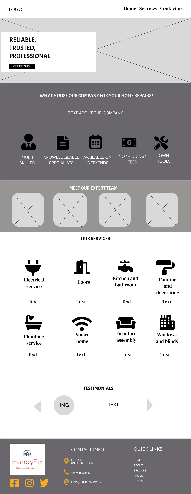
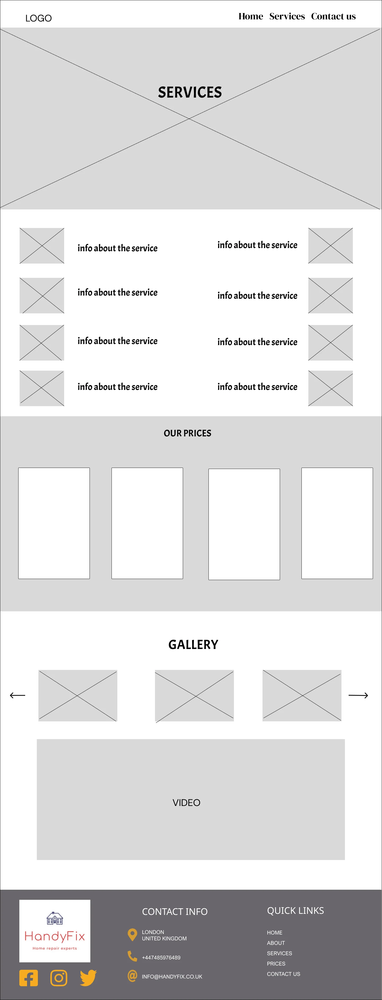
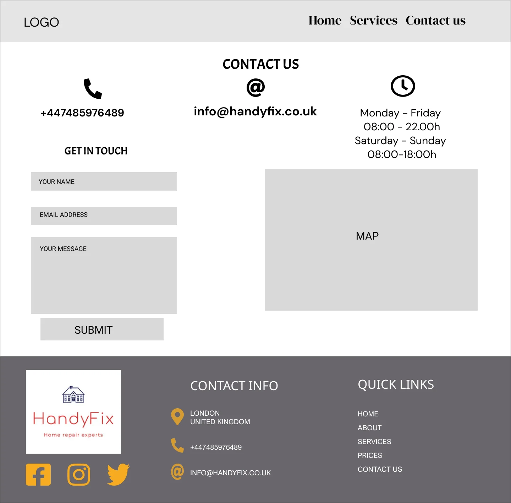

Tablet

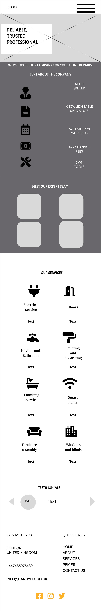
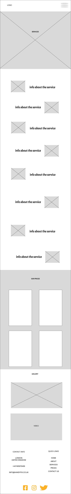
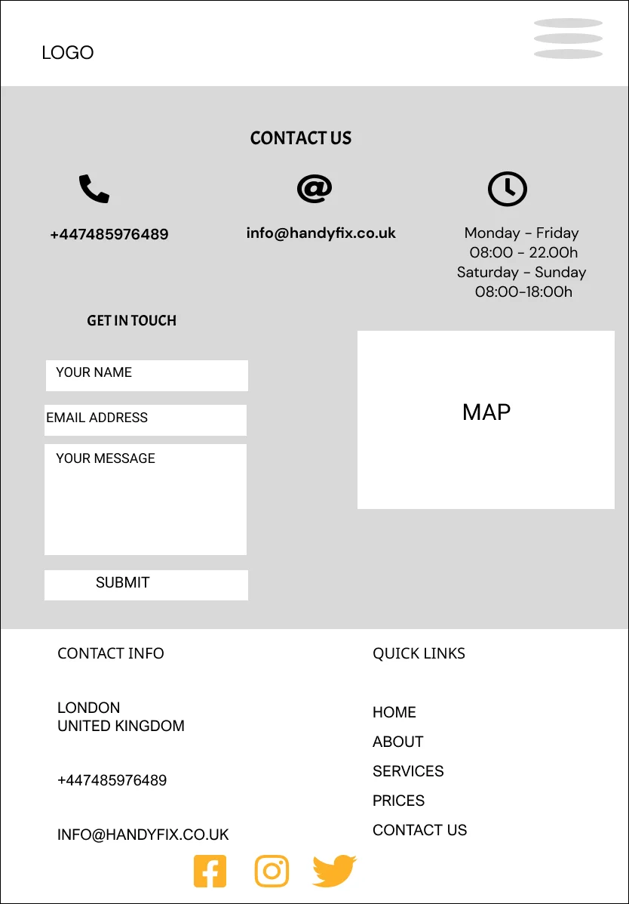

Mobile

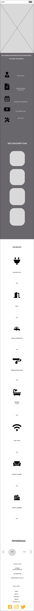
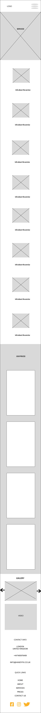
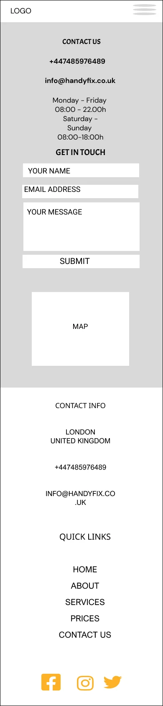

### **Surface**

**Colour**

The color palette is selected based on the unique meaning of each colors and their combination together. Orange color is associated with energy,warmth and enthusiasm.It is symbolized passion as well as quality, confidence and success. Also evoke feelings of excitement and optimism. It`s the color for creativity and innovation. Light beige is neutral color associated with simplicity, calmness and elegance. Beige symbolizes work and promotes hard work. Dark grayish-brown color gives stability and seriousness, which adds elegance to the color palette. The color symbolized intellect and stability.

The color combination of orange shade and a light beige shade can work together, especially if aiming for a warm and inviting color scheme. The orange provides a vibrant pop of color, while the light beige offers a soft and neutral backdrop. Together they are creating balances and harmonious color palette that feels welcoming and cheerful. Light beige and dark grayish-brown create balance due to the contrast between them. The combination between orange and dark grayish-brown create an attention-grabbing contrast. The palette were created using the site [Color-hex.com](https://www.color-hex.com/). Tints and Shades of these colours will be used also and are created using the site [Maketintsandshade.com](https://maketintsandshades.com/).

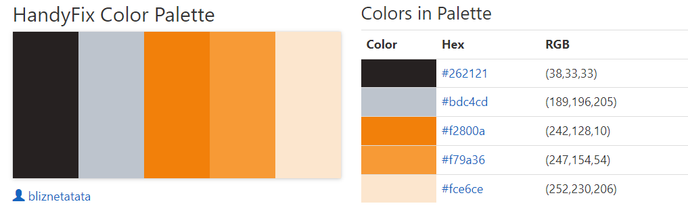

Tints and shades

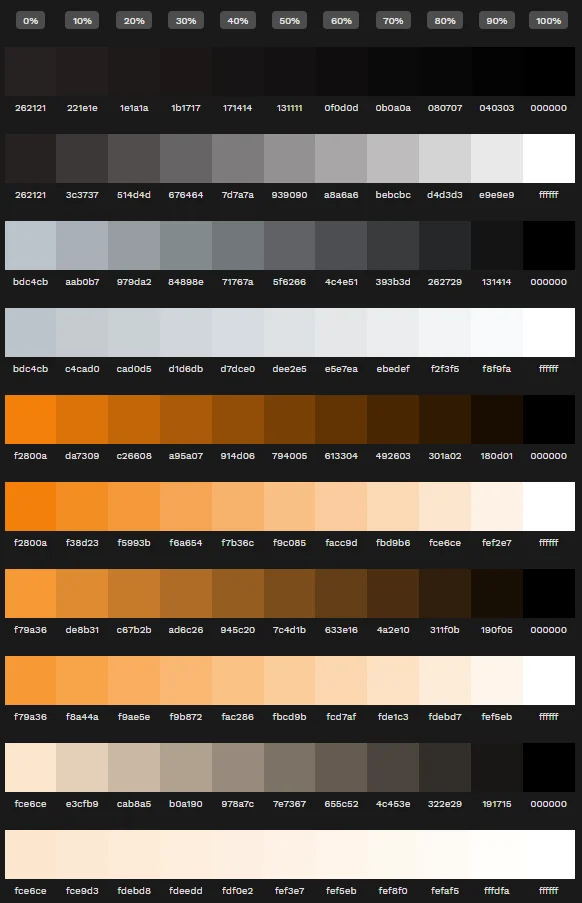 

**Typography**

The fonts that will be used in the website will be imported from [Google Fonts](https://fonts.google.com/) and will be used [Roboto](https://fonts.google.com/specimen/Roboto?query=roboto) and [Lato](https://fonts.google.com/specimen/Lato?query=lato). Roboto has clean and simple design which pairs well with Lato`s versatility and legibility. Together they are creating a sleek and minimalist look that is ideal for modern website. Both are sans-serif fonts that share similar characteristics in terms of letterforms and proportions in their modern desing. Lato has a slightly rounder and friendly appearance, while Roboto has a more geometric and modern feel. These differences create visual hierarchy and contrast in typography. Roboto will be used for the logo and headings in each section, while Lato will be used for the main body text.

**Logo**

The logo is created by myself using Figma design tool. The font for the brand is Roboto, for the slogan is Lato. The colors are choosen from the palette for the website. This will help users connect the logo with the colors of the company and website.

**Images**

The images on the pages were chosen to be relevant to the content of the page. All of them are regarding home repair services, handymen team and images of their previous work. The video has been selected to give the user a more in depth vision of what work quality the company is providing.

**Icons**

The icons that will be used are from [Font Awesome](https://fontawesome.com/) website. Having icons as the social media links immediately allows the user to easily identify which social media platform is which. Icons for the services are carefully chosen to be semantic relevance to represent concepts. They help users quickly understand and navigate throughout the website. The icons on the footer used to identify the opening hours, email and telephone number are all easily appealing on the eye for the user.

## Technologies Used

### Languages

* [HTML](https://en.wikipedia.org/wiki/HTML5)
* [CSS](https://en.wikipedia.org/wiki/Cascading_Style_Sheets)

### Tools

## Features

## Future features

## Deployment

### GitHub Pages

The site was deployed to GitHub pages. The steps to deploy are as follows: 
1. In the GitHub repository, navigate to the Settings tab 
2. From the left hand menu select 'Pages'
3. From the source select Branch: main
4. Click 'Save'
5. A live link will be displayed when published successfully. 

Link to the [live site] <!--add link to the live website here-->

### Forking the GitHub Repository

You can fork the repository by following these steps:
1. Go to the GitHub repository
1. Click on Fork button in upper right hand corner

### Cloning the GitHub Repository

You can clone the repository to use locally by following these steps:
1. Navigate to the GitHub Repository you want to clone
2. Click on the code drop down button
3. Click on HTTPS
4. Copy the repository link to the clipboard
5. Open your IDE of choice (git must be installed for the next steps)
6. Type git clone copied-git-url into the IDE terminal
7. Press 'enter' to create the clone

The project will now be cloned locally for you to use.

## Credits

### Content

### Media

## Acknowledgements
