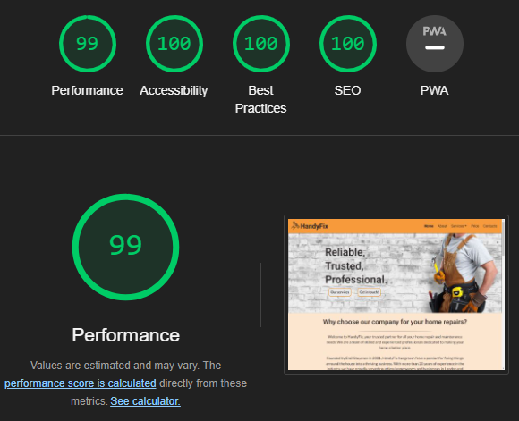
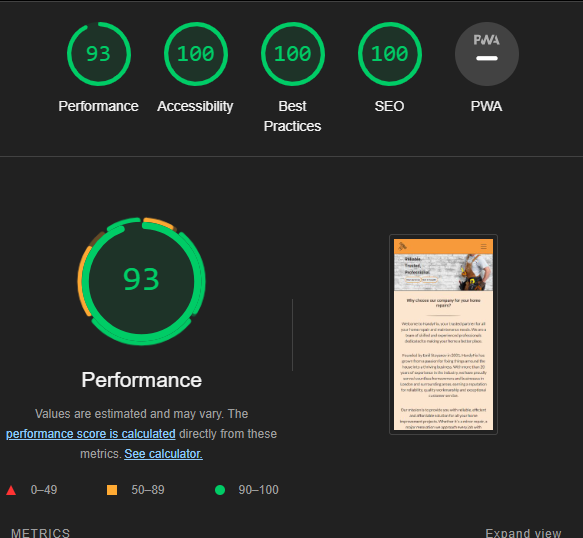
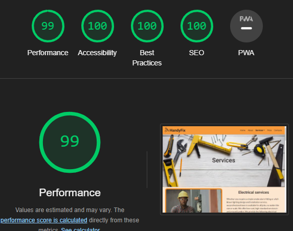
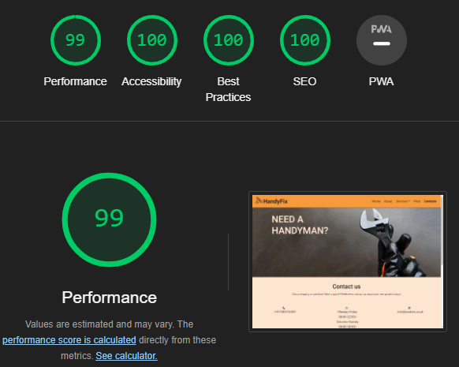
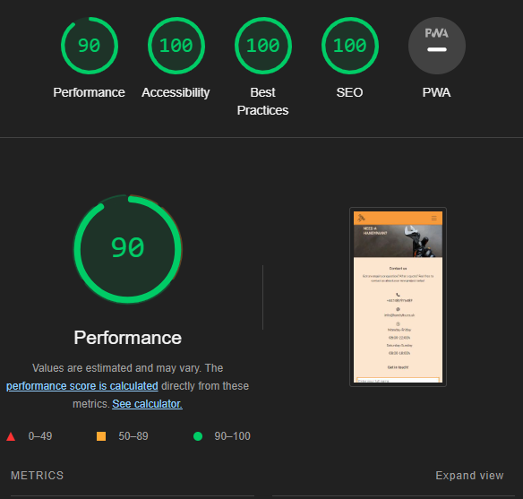
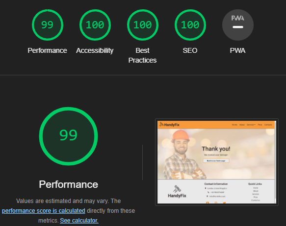
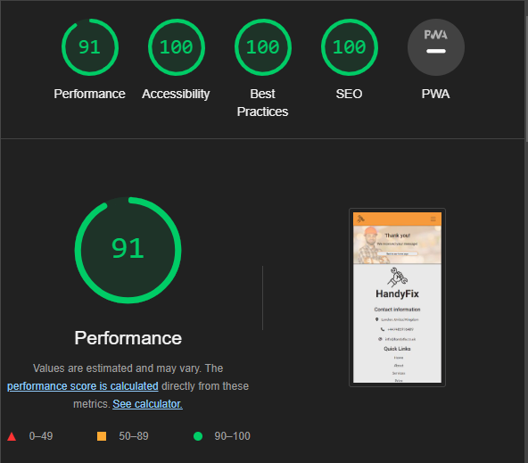

# HandyFix Testing

## Table of content
* [**Manual Testing**](#manual-testing)
* [**Browser Compatibility**](#browser-compatibility)
* [**Responsiveness**](#responsiveness)
* [**Performance**](#performance)
* [**Code Validation**](#code-validation)
* [**Bugs**](#bugs)
* [**Accessibility**](#accessibility)

## Manual Testing

### User stories

As a first-time visitor, I want to easily understand the main purpose of the site and learn more about the company.

| **Feature** | **Test case** | **Outcome** |
|-------------|---------------|-------------|
| Why choose our company for your home repair?(About)| Scroll down on home page and read information about the company.| User is brought to the information section about the company.|

As a first-time visitor, I want to be able to easily navigate through the site to find content.

| **Feature** | **Test case** | **Outcome** |
|-------------|---------------|-------------|
| Navigation bar| On top of each page there is a navigation bar; click on any link.| User is exploring the website.|
| Footer| Scroll down to the bottom on any page; find quick links; click on any link.| User is exploring the website.|

As a first-time visitor, I want to look for testimonials to understand what their users think of them and see if they are trusted.

| **Feature** | **Test case** | **Outcome** |
|-------------|---------------|-------------|
| Navigation bar|Click services; click testimonial| User is brought to testimonial section|
| Testimonials| Click on the logo; scroll down; read testimonials.| User can read feedback about the company.|

As a first-time visitor, I want to locate their social media links to determine how trusted and known they are.

| **Feature** | **Test case** | **Outcome** |
|-------------|---------------|-------------|
| Footer| Scroll down to the bottom on any page;click social media icon.| User is brought to social media links.|

As a first-time visitor, I want to have an insight into the company and where they operate.

| **Feature** | **Test case** | **Outcome** |
|-------------|---------------|-------------|
|Home page| Click Home on navbar;scroll down to read information about the company.| User knows where the company is operating.|
|Footer| Scroll down to the bottom on any page;see contact information.| User can see where the company is operating.|

As a first-time visitor, I want to be able to see what services they offer.

| **Feature** | **Test case** | **Outcome** |
|-------------|---------------|-------------|
|Navigation bar|Click Services on navbar;click on any service.|User can see what services are provided.|
|Our services|Click Home on navbar;scroll down to our services;see what services are provided;click on the service.|User can see what services the company is offering|
|Service page|Click Home; click our services button;scroll to read about the services.| User can see what services are provided.|

As a first-time visitor, I want to be able to see what the pricing is for each service or hourly.

| **Feature** | **Test case** | **Outcome** |
|-------------|---------------|-------------|
|Price|Click Price on navbar;read about the prices.| User is brought to price section.|

As a first-time visitor I want to see what is included in the price.

| **Feature** | **Test case** | **Outcome** |
|-------------|---------------|-------------|
||Price|Click Price on navbar;read about the prices,read the note under price cards.| User can read what is included in the price.|

As a first-time visitor I want to know how to get in touch with the company.

| **Feature** | **Test case** | **Outcome** |
|-------------|---------------|-------------|
|Contact page|Click Contact on navbar;scroll down; see the company contact information.| User can see contact details.|
|Get in touch|Click Contact on navbar;scroll to form;fill and submit the form.| User can get in touch with the company by filling the form.|
|Footer| Scroll down to the bottom on any page;see contact information.| User can see contact details.|

As a first-time visitor I want to see pictures of their previous project/work.

| **Feature** | **Test case** | **Outcome** |
|-------------|---------------|-------------|
|Navigation bar|Click services;click gallery|User is brought to gallery section|
|Gallery|Click Price on navbar;scroll down; see the gallery| User is brought to gallery section|

As a first-time visitor I want to see what hours the company operates at.

| **Feature** | **Test case** | **Outcome** |
|-------------|---------------|-------------|
||Contact page|Click Contact on navbar;scroll down; see the company`s operating hours.| User can see the company`s operating hours.|

As a first-time visitor I want to be able to see and click on the links to their social media pages.

| **Feature** | **Test case** | **Outcome** |
|-------------|---------------|-------------|
|Footer| Scroll down to the bottom on any page;click social media icon.| User is brought to social media links.|

As a first-time visitor I want to easily navigate through the site without becoming overwhelmed with too much information.

| **Feature** | **Test case** | **Outcome** |
|-------------|---------------|-------------|
|Navigation bar| On top of each page there is a navigation bar; click on any link.| User is exploring the website.|

As a first-time visitor I want to see where the company is located.

| **Feature** | **Test case** | **Outcome** |
|-------------|---------------|-------------|
|Get in touch|Click Contact on navbar;scroll to map;see adress on the map.| User can see where the company is located.|

As an owner, I want to generate new business by getting users to contact the company.

| **Feature** | **Test case** | **Outcome** |
|-------------|---------------|-------------|
|Get in touch|Click Contact on navbar;scroll to form;fill and submit the form.| User can get in touch with the company by filling the form.|

As an owner, I want users to easily navigate through the site and at the end be confident enough to contact the company.

| **Feature** | **Test case** | **Outcome** |
|-------------|---------------|-------------|
|Navigation bar| On top of each page there is a navigation bar; click on any link.| User is exploring the website.|

As owner, I want the site to show the motto of "quality over quantity" in terms of the information that is on display.

| **Feature** | **Test case** | **Outcome** |
|-------------|---------------|-------------|
|Gallery|Click Price on navbar;scroll down; see the gallery| User is brought to gallery section|

As owner, I want to encourage users to go to our social media pages which will help boost the profile of the company.

| **Feature** | **Test case** | **Outcome** |
|-------------|---------------|-------------|
|Footer| Scroll down to the bottom on any page;click social media icon.| User is brought to social media links.|

As owner, I want the site to be responsive so users on any platform can successfully navigate the site.

| **Feature** | **Test case** | **Outcome** |
|-------------|---------------|-------------|
|Website| Website is tested on different devices and browsers.|User can explore the website on any device.|

### Website

Buttons and links

| **Feature** | **Test case** | **Outcome** |
|-------------|---------------|-------------|
|Logo|Click logo|User is brought to the home page|
|Navbar/home| Click home|User is brought to the home page|
|Navbar/about|Click about|User is brought to home page section about|
|Navbar/services/...|Click services,click relevant service link|User is brougth to the choosen service on service page|
|Navbar/price|Click price|User is brought to service page section price|
|Navbar/contacts|Click contacts|User is brought to contact page|
|Our services|Click button our services|User is brought to service page|
|Get in touch|Click button get in touch|User is brought to contact page|
|Meet the team images|Move the mouse over the image|User will see personal information about the handyman|
|Facebook icon|Click icon|New tab is opening and user is brought to Facebook|
|Twitter icon|Click icon|New tab is opening and user is brought to Twitter|
|LinkedIn icon|Click icon|New tab is opening and user is brought to LinkedIn|
|Contact word in bold|Click word|User is brought to contact page|
|Electrical service|Click anywhere on the card electrical|User is brought to electrical service on service page|
|Plumbing service|Click anywhere on the card plumbing|User is brought to plumbing service on service page|
|Kitchen and bathroom|Click anywhere on the card kitchen and bathroom|User is brought to kitchen and bathroom service on service page|
|Painting and decorating|Click anywhere on the card painting and decorating|User is brought to painting and decorating service on service page|
|Assembly service|Click anywhere on the card assembly|User is brought to assembly service on service page|
|Smart home|Click anywhere on the card smart home|User is brought to smart home service on service page|
|Windows and blinds|Click anywhere on the card windows and blinds|User is brought to windows and blinds service on service page|
|Doors|Click anywhere on the card doors|User is brought to doors service on service page|
|Footer/Logo|Click logo|User is brought to the home page|
|Instagram icon|Click icon|New tab is opening and user is brought to Instagram|
|Footer/home|Click home| User is brought to the home page|
|Footer/about|Click about| User is brought to home page section about|
|Footer/services|Click services|User is brought to service page|
|Footer/price|Click price| User is brought to service page section price|
|Footer/contacts|Click contacts|User is brought to contact page|
|Back to top button|Click button|User is brought to top of the service page|
|Contact form|Submit an empty form|Error signalling required fields|
|Contact form|Submit filled form|User is brought to success page|
|Back to our home page|click button|User is brought to the home page|

[Back to top](#table-of-content)

## Browser Compatibility

| **Browser tested** | **Intended appearance** | **Intended responsiveness** | 
|--------------------|-------------------------|-----------------------------|
| Google Chrome      |
Very Good
|
Very Good
    |
| Mozzila            |
Very Good
|
Very Good
    |
| Firefox            |
Very Good
|
Very Good
    |
| Microsoft edge     |
Good
     |
Good
         |
| Safari*            |
Good
     |
Good
         |

* On Microsoft edge hero section taking large amount of space. Does not affect the website.
* There was issue regarding Safari browser. More details can be found [here](#resolved-bugs).
* There was no issues found regarding the appearance and responsiveness.

[Back to top](#table-of-content)

## Responsiveness

| **Device Tested** | **Site responsive** | **Renders as expected** | 
|-------------------|---------------------|-------------------------|
| Samsung Galaxy S21 Ultra|
Very Good
|
Yes
|
| Iphone 5s/6s      |
Very Good
|
Yes
|
| Ipad              |
Very Good
|
Yes
|
| Samsung Galaxy Tab 3|
Very Good
|
Yes
|
| Desktop           |
Very Good
|
Yes
|
| Laptop            |
Very Good
|
Yes
|
| Google Dev Tools  |
Very Good
|
Yes
|

* There was no issues found regarding the responsiveness.

[Back to top](#table-of-content)

## Performance

Index.html

, 

Service.html

, 

Contact.html

, 

* There is a warning regarding Google Map and JavaScript. No further action is taken.

Success.html

, 

*  The site was tested through Google Chrome Dev Tools - Lighthouse to check each of the pages for performance, accessibility, best practices and SEO.
* On mobile devices the site is loading a bit slower than on large screen devices. This is due to image sizes, longer pages and large layout shifts. At the moment no further action is taken, but improvements will be made in future.

[Back to top](#table-of-content)

## Code Validation

### HTML Validation

Index.html

Service.html

* Solution 

* Final Validation

Contact.html

* Solution 

* Final Validation

Success.html

* The validation site [W3C HTML Validator](https://validator.w3.org/nu/) was used to validate the HTML. Some errors were found and resolved.

### CSS Validation

CSS Test

* The validation site [W3C CSS Validator](https://jigsaw.w3.org/css-validator/#validate_by_input) was used to validate the CSS. No errors were found. There were 3 warnings regarding vendor extensions, but doesn`t affect the website.

### Link Checker

Link Test

* The validation site [W3C Link Checker](https://validator.w3.org/checklink) was used to check the website for broken links. There were no broken links found, but three links were manually checked and worked as expected. They were not checked due to robots exclusion rules.

[Back to top](#table-of-content)

## Bugs

### Resolved bugs

Autocomplete attribute in form

* Solution

* After testing the form two issues came up. There were not found autocomplete attribute. After research autocomplete atribute were added for better accessibility and better user experience. 

Link missing discernible name

* Solution

* When submiting the form, the user is forwarded to success page. On the code were missing title for the link and it was empty. After adding title the problem was solved.

Responsive images- Test with Lint

* Solution

* Final test

* All pages were tested during coding with [Responsive Image Linter](https://chromewebstore.google.com/detail/responsive-image-linter/mnddginionlghpblkimpdalcecpnbjln?pli=1). The extension provided srcset and sizes to make the images responsive. The solution is used for all images on the website. All images are responsive.

Map was translated

* Solution

* When copied the code for the map, the page were automatically translated in Bulgarian language. It was noticed at some point and then were added the new code.

Safari is not displaying images

* Solution

* When checked on the real devices Iphone 5, Iphone 6 and Ipad, all the images did not display. After research about the WEbP format images compatibility, was found that only from IOS 14 and up support this format. The solution were found in [Stack Overflow](https://stackoverflow.com/) and was to add fallback images in different format from WEbp. Fallback images were added for all images on the website. Google Dev Tools didn`t show up this problem-there all images were working on the Iphone 5, Iphone 6 plus and Ipad.

Contact page title

* Solution

* Final result

* After html validation on the contact page, the bug with open tags was fixed. After that the title position changed. It was fixed by changing top property in a class cover-text-contact. It was changed or remove from media queries as appropriate.

[Back to top](#table-of-content)

## Accessibility

### Color contrast

* The main colors, used for the website, have very good contrast. They were tested with [WebAIM contrast checker](https://webaim.org/resources/contrastchecker/).

, , 

### WAVE Web Accessibility Evaluation Tools

* On all pages same alert came up - that there is more than 1 redundant link. This is, because some links are navigating users to the same page, but was made to be user friendly and intuitive as possible for the user. No further action was taken.

* On service page alert came up about the video. The video does not have audio and does not need synchronized captioning and a transcript. No further action was taken.

Home page

* First test

* Alerts

* Solution

First solution was to change p to h4 to the four images of the section. Second solution was to change alt text to images in the testimonial section.

* Final result

Service page

* First test

* Alerts

* Solution

Solution was to change alt text to one image on the page.

* Final result

Contact page

* First test

* Alerts

* Solution

Solution for the contrast was to change the background-color of the hero image. In case if the hero image does not load background-color will show up and it will be in very good contrast with the title color. In the form labels were empty and was missing aria-label to the input attributes. The code was fixed.

* Final result

Success page

* First test

* Solution

First solution was to change p to h2 to the heading under the h1. Second solution was to change alt text for the hero image.

* Final result

[Back to top](#table-of-content)